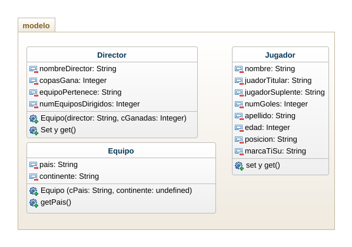

## Ejercicio - Caso 

        -> Diseño
        #Diagramas de clases

- La fifa a solicitado el diseño y el acceso de una app para registrar la informacion requirada sobre los 32 paises participantes en la copa mundial de futbol Qatar 2022, de cada pais debe almacenarce el nombre, el conteninte al que pertenece, el numero de participaciones en la copa del mundo, el numero de copas ganadas, los datos del director tecnico actual, la lista de los 11 jugadores titulares y la lista de 11 jugdores suplentes. de cada jugador se debe tener informacion relacionada con su nombre, apeelido, edad, posicion en el equipo y numeros de goles marcados en copas mundiales. Implemente el diagrama de clases y la app utlizando el patron MVC. 

Clases 
- Pais 
        + Informacion de 32 paises
        + nombre 
        + continente 
- Equipo 
        + numero de participantes a la copa del mundo 
        + numero de copas ganadas
        + lista de los 11 jugadores titulares
        + lista de los 11 jugadores suplentes
- Datos director tecnico actual
        - nombre 
        - apellido 
        - edad 
        - equipo al que pertenece 
- Jugador 
        + nombre 
        + apellido 
        + edad 
        + posicion en el equipo 
        + numero de goles marcados 
